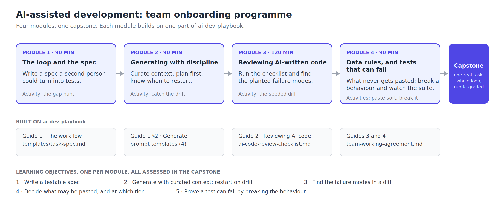

# AI-assisted development: team onboarding programme

A four-module programme for software teams adopting AI coding assistants. It's the training companion to [ai-dev-playbook](https://github.com/omarmaali/ai-dev-playbook): the playbook is the reading, this repo is the course built on it, with learning objectives, exercises, knowledge checks, a graded capstone and a facilitator guide.

I put this together from internal enablement sessions I ran for developers, QA and a few non-engineering teams, and from classroom delivery as a Microsoft Certified Trainer and OutSystems Certified Trainer. My view after those sessions is that nobody needs training on how to generate code. The skills that are missing are writing a spec tight enough to delegate, reading a diff you didn't write, and knowing whether a test can actually fail.



## Who it's for

Working developers and QA engineers on a team that is adopting, or has already informally adopted, AI coding assistants. It assumes participants can read a diff in their own language and run their test suite. It doesn't assume any prior use of AI tools, and no exercise depends on a particular one.

There's a shorter cut for non-engineering teams in the [facilitator guide](facilitator/facilitator-guide.md#adapting-for-other-audiences): module 1 and the data rules from module 4, about three hours.

## Learning objectives

By the end of the programme a participant can:

1. Write a one-page task spec, with acceptance checks, that a second person could turn into tests without asking a question.
2. Run a generation session with curated context, and recognise the signals that mean the session should be restarted.
3. Review an AI-authored diff with the checklist and find the named failure modes planted in it.
4. Decide, for a given piece of information, whether it may go into an AI tool at all, and at which tier, and apply the incident rule when it goes wrong.
5. Show whether a test can fail, by breaking the behaviour it claims to cover and reporting what the suite did.

Each objective maps to one module and is assessed in the capstone.

## Structure

| Module | Title | Objective | Pre-reading (playbook) | Live time |
|---|---|---|---|---|
| 1 | [The loop and the spec](program/01-spec.md) | 1 | Guide 1, task-spec template | 90 min |
| 2 | [Generating with discipline](program/02-generate.md) | 2 | Guide 1 §2, prompt templates | 90 min |
| 3 | [Reviewing AI-written code](program/03-review.md) | 3 | Guide 2, review checklist | 120 min |
| 4 | [Data rules, and tests that can fail](program/04-data-rules-and-tests.md) | 4, 5 | Guides 3 and 4, working agreement | 90 min |
| 5 | [Capstone](program/05-capstone.md) | all | | own time, about 3 hours |

Recommended cadence is one module per week, run alongside the pilot described in playbook guide 5, so participants apply each module to a real task before the next one. It also runs as a two-day intensive; the facilitator guide has timings for both.

Each module file contains its objectives, the pre-reading, a hands-on activity, and a five-question knowledge check. Answer keys are in [assessment/answer-keys.md](assessment/answer-keys.md).

## Assessment

Two layers. The knowledge checks at the end of each module are quick and ungraded; they tell the facilitator what didn't land before the next session.

The capstone is graded. Each participant runs one real task from their own backlog through the full loop and submits five artefacts: the spec, the diff, the completed review checklist, evidence that they broke a behaviour and watched a test fail, and a short note on what the model got wrong. The [rubric](assessment/capstone-rubric.md) has five criteria at three levels, one criterion per learning objective.

## What's in the repo

```
program/         five module files: 01 to 04 plus the capstone brief
assessment/      capstone rubric and the knowledge-check answer keys
facilitator/     facilitator guide (session plans, timings, audience variants)
                 and the recipe for building the seeded diff module 3 needs
docs/img/        the programme map
```

The content itself lives in the playbook. Every module links to the guide or template it builds on rather than restating it.

## Running it yourself

If you're a team lead: read playbook guides 1 and 5, then the facilitator guide. The seeded diff for module 3 is the one piece of preparation with real lead time; the recipe is in `facilitator/`.

If you're a solo developer working through it alone: do the modules in order, do the pair exercises with a model as your partner, and still do the capstone.

## What this isn't

It isn't a course on any particular tool. It isn't a certification; the rubric tells a team lead who is ready to work unpaired on AI-assisted tasks, and that's the only judgement it's designed for. It doesn't claim productivity numbers, for the reasons playbook guide 4 sets out.

## License

MIT.
